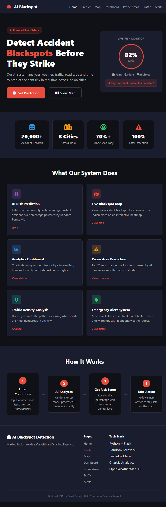
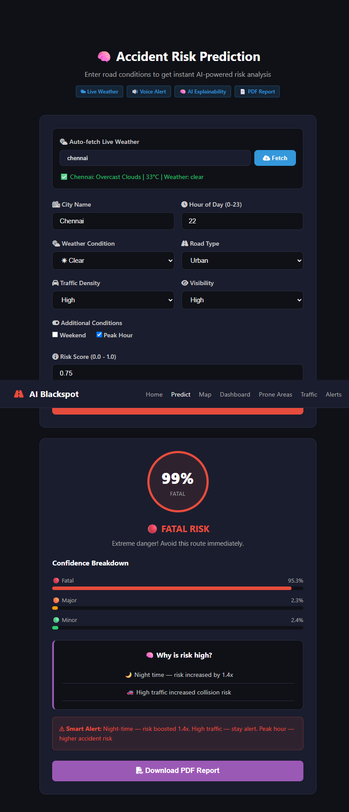
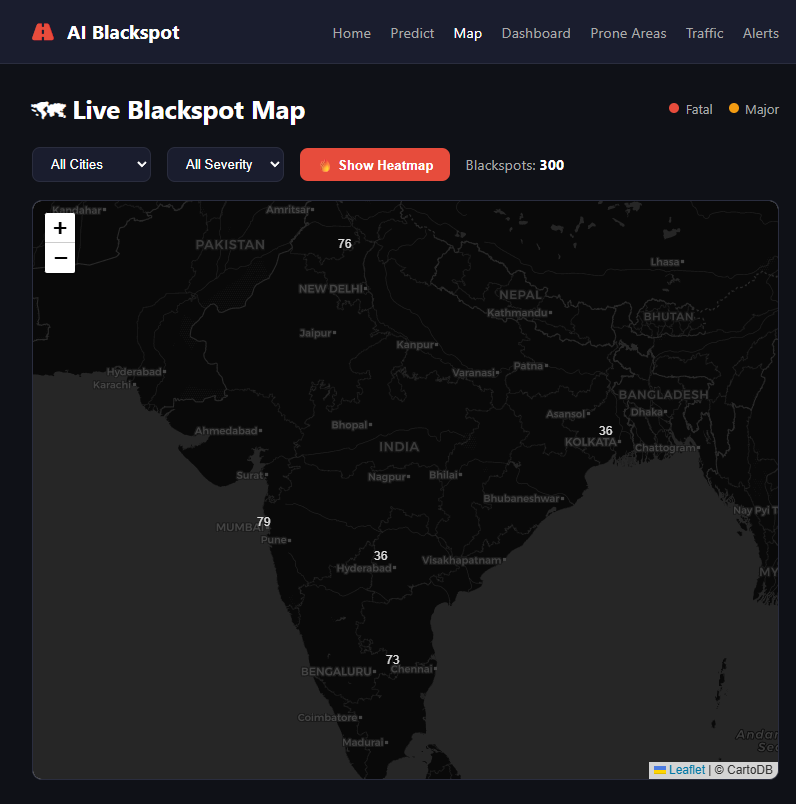
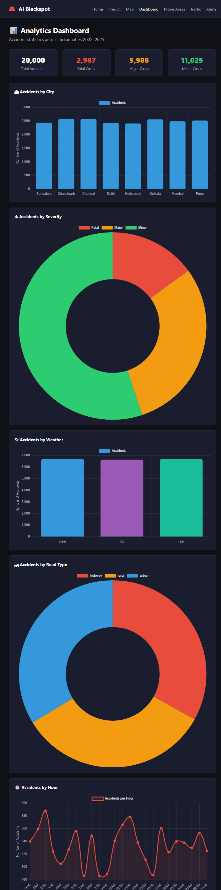
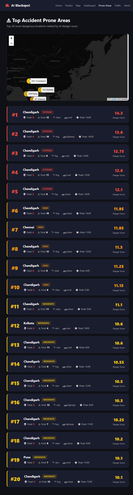
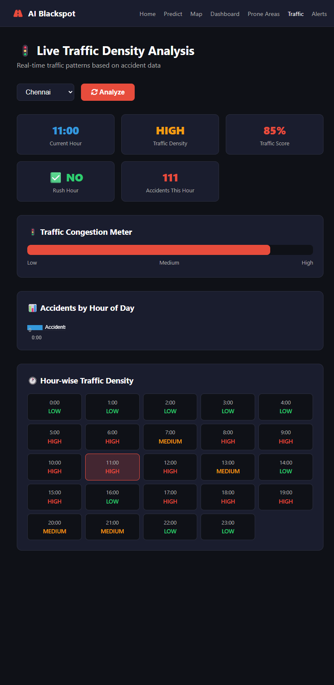
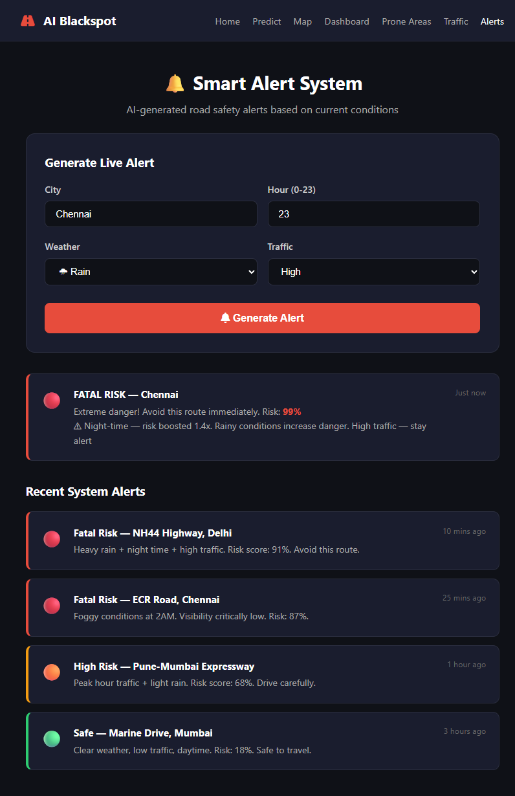

# 🚗 AI Blackspot Detection System

> An AI-powered road accident blackspot detection and prediction system built for Indian roads.
> Trained on 20,000 real accident records from 8 major Indian cities.

---

## 🌐 Live Demo
🔗 [Click here to view live project](https://jesima932-ai-blackspot-predictor.hf.space/)

---

## 📸 Screenshots

### Home Page


### AI Risk Prediction


### Blackspot Map with Heatmap


### Analytics Dashboard


### Accident Prone Areas


### Traffic Density Analysis


### Emergency Alert System


---

## 🎯 What This Project Does

This system helps drivers, traffic authorities and urban planners by:
- Predicting accident risk before it happens
- Showing dangerous blackspot locations on a map
- Sending emergency alerts when fatal risk is detected
- Analyzing traffic patterns hour by hour
- Providing downloadable PDF reports for authorities

---

## ✨ Features

| Feature | Description |
|---|---|
| 🧠 AI Risk Prediction | Predicts Fatal / Major / Minor risk using Random Forest ML |
| 🗺 Blackspot Map | Interactive map showing real accident locations across India |
| 🔥 Heatmap | Color gradient showing danger zones |
| 📊 Analytics Dashboard | Charts showing accidents by city, weather, hour, road type |
| ⚠ Prone Area Prediction | Top 20 most dangerous locations ranked by AI danger score |
| 🚦 Traffic Density Analysis | Hour-by-hour traffic patterns for any city |
| 🌤 Live Weather API | Auto-fetches real weather for any Indian city |
| 🔔 Emergency Alert System | Auto email alert when fatal risk detected |
| 📄 PDF Report | Download prediction result as professional report |
| 🔊 Alert Sound | Gentle chime sound when risk is detected |
| 🗣 Voice Alert | AI voice speaks the risk level out loud |
| 🧠 AI Explainability | Shows exactly WHY the risk is high or low |

---

## 🛠 Tech Stack

### Backend
- **Python 3.10+** — Core language
- **Flask** — Web framework and REST API
- **Scikit-learn** — Random Forest ML model
- **Pandas / NumPy** — Data processing
- **Joblib** — Model saving and loading

### Frontend
- **HTML5 / CSS3** — Pages and styling
- **JavaScript** — Frontend logic
- **Leaflet.js** — Interactive map
- **Chart.js** — Analytics charts
- **Web Audio API** — Alert sounds
- **Speech Synthesis API** — Voice alerts

### APIs and Data
- **OpenWeatherMap API** — Live weather data
- **Indian Roads Dataset** — 20,000 accident records (2022–2025)

---

## 📁 Project Structure

```
AI_Blackspot_Project/
│
├── screenshots/             # Project screenshots
│
├── backend/
│   ├── app.py               # Flask server and REST APIs
│   ├── train_model.py       # ML model training script
│   ├── weather_api.py       # Live weather fetching
│   ├── prone_areas.py       # Accident prone area analysis
│   ├── alert_system.py      # Emergency email alerts
│   ├── model.pkl            # Trained Random Forest model
│   ├── encoders.pkl         # Label encoders
│   ├── feature_columns.pkl  # Feature column names
│   ├── accident_data.csv    # Dataset (20,000 records)
│   └── requirements.txt     # Python dependencies
│
└── frontend/
    ├── templates/
    │   ├── index.html       # Home page
    │   ├── predict.html     # Prediction page
    │   ├── map.html         # Blackspot map
    │   ├── dashboard.html   # Analytics dashboard
    │   ├── prone.html       # Prone areas page
    │   ├── traffic.html     # Traffic analysis page
    │   └── alert.html       # Alert system page
    │
    └── static/
        ├── style.css        # Website styling
        ├── script.js        # Prediction and alert logic
        ├── map.js           # Map and heatmap logic
        └── dashboard.js     # Chart logic
```

---

## 🚀 How to Run Locally

### Step 1 — Clone the repository
```bash
git clone https://github.com/jesima932/AI_Blackspot_Project.git
cd AI_Blackspot_Project
```

### Step 2 — Install dependencies
```bash
cd backend
pip install -r requirements.txt
```

### Step 3 — Add dataset
Download `indian_roads_dataset.csv` from Kaggle and rename to `accident_data.csv` inside `backend/`

### Step 4 — Train the model
```bash
python train_model.py
```

### Step 5 — Run the server
```bash
python app.py
```

### Step 6 — Open browser
```
http://localhost:5000
```

---

## 📊 Model Details

| Property | Value |
|---|---|
| Algorithm | Random Forest Classifier |
| Dataset | 20,000 Indian accident records |
| Features | Weather, Road Type, Hour, Traffic, Visibility, Risk Score |
| Target | Accident Severity (Fatal / Major / Minor) |
| Accuracy | 70.77% |
| Fatal Detection | 100% precision |
| Training size | 12,000 rows |
| Testing size | 3,000 rows |

---

## 🌆 Cities Covered

Delhi • Mumbai • Chennai • Bangalore • Kolkata • Hyderabad • Pune • Chandigarh

---

## 📱 Pages

| Page | Purpose |
|---|---|
| Home `/` | Project introduction |
| Predict `/predict` | AI risk prediction |
| Map `/map` | Blackspot map and heatmap |
| Dashboard `/dashboard` | Accident statistics |
| Prone Areas `/prone` | Top 20 danger zones |
| Traffic `/traffic` | Hour-wise traffic analysis |
| Alerts `/alert` | Emergency alert system |

---

## ⚙ Requirements

```
flask
pandas
numpy
scikit-learn
joblib
requests
folium
```

---

## 🔑 API Keys Required

- **OpenWeatherMap API** — Free at [openweathermap.org](https://openweathermap.org)
- Add your key in `weather_api.py`

---

## 👨‍💻 About

Built by **Jesima** — B.Sc Computer Science student from Madurai, Tamil Nadu.
This project was built to make Indian roads safer using machine learning and data analysis.

---

## 🔗 Links

- 🚀 **Live Demo** — [https://jesima932-ai-blackspot-predictor.hf.space/](https://jesima932-ai-blackspot-predictor.hf.space/)
- 💻 **GitHub** — [https://github.com/jesima25](https://github.com/jesima25)

---

## 📄 License

This project is open source and available under the [MIT License](LICENSE).

---

## ⭐ If you found this useful please give it a star!